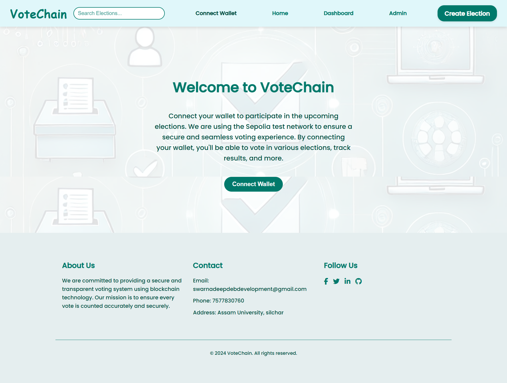

# Blockchain-Based Online Voting System

  




## Demo Video

<div align="center">
    <a href="https://youtu.be/NK5xVZXsehA">
        
    </a>
</div>


## Overview

The **Blockchain-Based Online Voting System** is a decentralized application (DApp) designed to enable secure, transparent, and tamper-resistant online voting. By leveraging blockchain technology, this system ensures that votes are immutable and auditable, providing voters and election organizers with an increased level of trust.

This system is ideal for governments, organizations, or communities looking to adopt a more reliable and transparent voting mechanism.

## Key Features

- **Decentralized & Secure**: Utilizes blockchain technology to ensure the integrity and security of votes.
- **Transparency**: Voting data is publicly available on the blockchain, allowing for verifiability without compromising voter anonymity.
- **Immutability**: Once a vote is cast, it cannot be altered, ensuring a fair election process.
- **User-friendly Interface**: A simple and intuitive React-based frontend for a seamless user experience.
- **Scalability**: Capable of handling elections with a large number of voters and candidates.
  
## Project Structure

The project is organized into the following key components:

- **Frontend**: Developed using React.js, providing a responsive and easy-to-use interface for voters to cast their votes and for administrators to manage elections.
- **Smart Contracts**: Deployed on the Ethereum blockchain, written in Solidity. These contracts manage the voting process, ensuring that votes are securely recorded.
- **Blockchain Integration**: Ethereum blockchain is used to store and verify votes, ensuring immutability and transparency.

## Technologies Used

- **Blockchain**: Ethereum (Solidity, ether.js)
- **Frontend**: React.js, CSS, JavaScript
- **Backend**: Node.js, Express.js
- **Development Tools**: Hardhat for smart contract testing and deployment
- **Database**: MongoDB for user management and election metadata

## Setup Instructions

### Prerequisites

- Node.js and npm installed
- MetaMask extension for interacting with Ethereum blockchain

### Installation

1. Clone the repository:
    ```bash
    git clone https://github.com/SwarnadeepDeb/Blockchain-based-Online-Voting-System.git
    cd Blockchain-based-Online-Voting-System
    ```

2. Install dependencies:
    ```bash
    npm install
    ```

3. Compile and deploy smart contracts:
    ```bash
    npx hardhat compile
    npx hardhat run scripts/deploy.js --network <network-name>
    ```

4. Run the development server:
    ```bash
    npm start
    ```

## Usage

1. **Admin Role**: Admin can create new elections, add candidates, and monitor results.
2. **Voter Role**: Voters can securely cast their votes and verify their voting record on the blockchain.
3. **Election Monitoring**: Anyone can verify the integrity of votes through blockchain exploration.


## Demo

A live demo of the application can be accessed [here](#) (add your demo link).

## Screenshots

  
*Wallet Connection*

  
*Election Creation*

  
*Candidate Registration*

  
*Voter Registration*

  
*Admin dashboard*

  
*Vote Form*


## Future Enhancements

- **Mobile Application**: A mobile app for easier voting access.

## Contributing

Contributions are welcome! Please open an issue or submit a pull request if you’d like to improve the project.

## License

This project is licensed under the MIT License - see the [LICENSE](./LICENSE) file for details.
